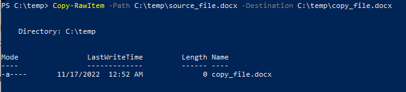

Взаимодействие с Windows API с помощью PowerShell
=============
Для решения некоторых задач в PowerShell может быть недостаточно встроенного функционала. В таких случаях может потребоваться использовать функции Windows API.
Ниже приведены 3 способа решения этой задачи:

1. [Взаимодействие с Windows API через командлет Add-Type](#1-взаимодействие-с-windows-api-через-командлет-add-type)
 - [Краткое описание метода](#краткое-описание-метода)
 - [Пример использования](#use-case-example)
2. Посредством получения ссылки на приватный тип в .NET Framework, который позволит вызвать требуемую функцию Windows API
3. Используя .NET рефлексию для динамического определения метода

## 1. Взаимодействие с Windows API через командлет Add-Type

### Краткое описание метода

Данный метод заключается в применении командлета [Add-Type](https://learn.microsoft.com/en-us/powershell/module/microsoft.powershell.utility/add-type) для создания объекта .NET из исходного кода на С#, в котором объявляется  вызов функции Windows API в формате С#. 

Метод состоит из следующих шагов:

1.	Найдите описание функции, которую необходимо использовать, а также наименование библиотеки, в которой она реализована, на официальной странице документации к [Windows API](https://learn.microsoft.com/en-us/windows/win32/api/).
2.	Для взаимодействия с функцией Windows API преобразуйте её описание с языка C/C++ в описание на языке С#, а также подключите библиотеку, в которой она реализована.
> Примечание. Для преобразования элементов C/C+ в тип .NET можно воспользоваться информацией, представленной на сервисе [Pinvoke](http://www.pinvoke.net/).
3.	Используйте командлет `Add-Type` для создания нового типа в сессии Powershell, который позволит вызвать нужную функцию Windows API.
4.	Вызовите требуемую функцию с помощью созданного объекта. 

### Use case example 

#### Using the Add-Type cmdlet to call the CopyFile function

The `Add-Type` cmdlet lets you add a .NET Framework object to your PowerShell session by compiling C# code at runtime. 

The below example demonstrates how to call the Windows API [CopyFile](https://learn.microsoft.com/en-us/windows/win32/api/winbase/nf-winbase-copyfile) function within PowerShell using `Add-Type`. To wrap it up, we will create the `Copy-RawItem` function and define its arguments: 

<pre>function Copy-RawItem
{
[CmdletBinding()]
    [OutputType([System.IO.FileSystemInfo])]
    Param (
        [Parameter(Mandatory = $True, Position = 0)]
        [ValidateNotNullOrEmpty()]
        [String]
        $Path,
        [Parameter(Mandatory = $True, Position = 1)]
        [ValidateNotNullOrEmpty()]
        [String]
        $Destination,
        [Switch]
        $FailIfExists
    )
}</pre>

**Steps:**
1. As we can learn from Windows API, the `CopyFile` function is available in [kernel32.dll](https://learn.microsoft.com/en-us/windows/win32/api/winbase/nf-winbase-copyfile#requirements).
2.	Convert the C/C++ types to the equivalent .NET type. `CopyFile` in two different types is represented in the following table:

 C/C++ type |.NET type 
------- | --------
|<pre>BOOL CopyFile(  [in] LPCTSTR lpExistingFileName,[in] LPCTSTR lpNewFileName,  [in] BOOL    bFailIfExists );<pre>| <pre>[DllImport("kernel32.dll", CharSet = CharSet.Unicode,   SetLastError = true)]   public static extern bool CopyFile(string lpExistingFileName,  string lpNewFileName, bool bFailIfExists);<pre>

> Note: make sure that you have defined the `CopyFile` method as public in order to easily interact with it in Windows PowerShell. 

3.	Create an object using `Add-Type` to call the CopyFile function from Windows API.
Call `Add-Type`, specifying the C# source code, a type name, and a namespace, to create the new type in WindowsPowerShell.

<pre>
$MethodDefinition = @’
[DllImport(“kernel32.dll”, CharSet = CharSet.Unicode)]
public static extern bool CopyFile(string lpExistingFileName, string lpNewFileName, bool bFailIfExists);
‘@
$Kernel32 = Add-Type -MemberDefinition $MethodDefinition -Name ‘Kernel32’ -Namespace ‘Win32’ -PassThru
</pre>

4.	Call `CopyFile` directly within Windows PowerShell. 

<pre>$CopyResult = $Kernel32::CopyFile($Path, $Destination, ([Bool] $PSBoundParameters['FailIfExists']))</pre>

[Here](example.ps1) you can get the full example code to run it yourself.

The screenshot below demonstrates the result: the source_file.docx has been copied successfully to the required destination using the `CopyFile` function from Windows API.

## References

- For more information on how to convert C/C++ types to the equivalent .NET type, see [Pinvoke](http://www.pinvoke.net/)
- How to interact with Win API via the Add-Type cmdlet: [Use PowerShell to Interact with the Windows API: Part 1](https://devblogs.microsoft.com/scripting/use-powershell-to-interact-with-the-windows-api-part-1/)
- Detailed documentation on [Add-Type](https://learn.microsoft.com/en-us/powershell/module/microsoft.powershell.utility/add-type)

